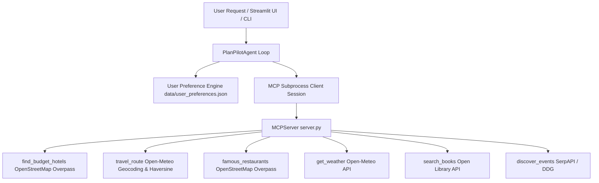

# 🧭 PlanPilot API Documentation

Welcome to the **PlanPilot API Documentation**. This reference guide covers the Model Context Protocol (MCP) Tool APIs, Core Python Agent API, User Preference API, underlying Service API, Evaluation Metrics & Telemetry, and CLI interfaces with complete request/response examples.

---

## 🛠️ Table of Contents
1. [Architecture Overview](#-architecture-overview)
2. [MCP Tool Server API (6 Tools)](#-mcp-tool-server-api-6-tools)
   - [`find_budget_hotels`](#1-find_budget_hotels)
   - [`travel_route`](#2-travel_route)
   - [`famous_restaurants`](#3-famous_restaurants)
   - [`get_weather`](#4-get_weather)
   - [`search_books`](#5-search_books)
   - [`discover_events`](#6-discover_events)
3. [Evaluation Metrics & Telemetry Framework](#-evaluation-metrics--telemetry-framework)
4. [PlanPilot Agent Python API](#-planpilot-agent-python-api)
5. [User Preferences API & Departure Fallback](#-user-preferences-api--departure-fallback)
6. [Direct Services API & Haversine Distance](#-direct-services-api--haversine-distance)
7. [CLI & Web Interface API](#-cli--web-interface-api)
8. [Logging Configuration](#-logging-configuration)

---

## 🏗️ Architecture Overview



---

## 🔌 MCP Tool Server API (6 Tools)

### 1. `find_budget_hotels`
Queries OpenStreetMap Overpass API for accommodations and stays within a city. Supports budget tiers (`low`, `mid-range`, `premium`, `luxury`).

#### **Parameters:**
| Parameter | Type | Required | Description | Example |
| :--- | :--- | :--- | :--- | :--- |
| `city` | `str` | Yes | Target city name | `"Jaipur"` |
| `budget` | `str` | No | Budget tier (`low`, `mid-range`, `premium`, `luxury`) | `"low"` |

#### **Sample JSON Response:**
```json
[
  {
    "hotel_name": "Zostel Jaipur",
    "price_range": "₹800 - ₹1,800/night",
    "rating": "4.6 ⭐",
    "location": "MI Road, City Centre",
    "amenities": "Free WiFi, Rooftop Cafe, AC Rooms",
    "source": "OpenStreetMap Overpass API"
  }
]
```

---

### 2. `travel_route`
Validates real-world cities via Open-Meteo geocoding. Rejects fake/gibberish cities (`asdfgh`, `qwerty`). Computes Haversine Great Circle distances, travel times, transport modes (Train, Bus, Flight, Drive), and route summaries.

#### **Parameters:**
| Parameter | Type | Required | Description | Example |
| :--- | :--- | :--- | :--- | :--- |
| `source` | `str` | Yes | Departure city | `"Ahmedabad"` |
| `destination` | `str` | Yes | Arrival city | `"Jaipur"` |

#### **Sample JSON Response:**
```json
{
  "source": "Ahmedabad, Gujarat India",
  "destination": "Jaipur, Rajasthan India",
  "distance_km": "675 km",
  "travel_time": "11.2 hrs (Drive) | 9.6 hrs (Train)",
  "recommended_mode": "Direct Flight or Express Train",
  "transport_options": [
    {
      "mode": "Train",
      "option": "Express / Superfast Train",
      "duration": "9.6 hrs",
      "approx_cost": "₹800 - ₹1,800"
    },
    {
      "mode": "Flight",
      "option": "Direct / Connecting Flight",
      "duration": "1.3 hrs",
      "approx_cost": "₹3,200 - ₹5,500"
    }
  ],
  "route_summary": "Calculated real-world geographic corridor connecting Ahmedabad and Jaipur (approx 675 km)."
}
```

---

### 3. `famous_restaurants`
Suggests famous local restaurants, iconic dining spots, authentic regional specialities, ratings, and locations. Features curated heritage lists for major cities, cuisine filtering (e.g. `vegetarian`, `vegan`, `Italian`, `seafood`), and live OpenStreetMap Overpass spatial queries (`node["amenity"="restaurant"]["name"]`).

#### **Parameters:**
| Parameter | Type | Required | Description | Example |
| :--- | :--- | :--- | :--- | :--- |
| `city` | `str` | Yes | Target city name | `"Jaipur"` |
| `query` | `str` | No | Optional cuisine preference or dish search | `"vegetarian"` |

#### **Sample JSON Response:**
```json
[
  {
    "restaurant_name": "Laxmi Misthan Bhandar (LMB)",
    "speciality": "Authentic Rajasthani Thali, Ghewar, Pyaaz Kachori (Pure Veg)",
    "rating": "4.6 ⭐",
    "location": "Johari Bazaar, Old City",
    "why_popular": "Iconic 290-year-old heritage eatery world-famous for traditional Rajasthani Royal Thali & Ghewar."
  }
]
```

---

### 4. `get_weather`
Fetch current weather and 12-hour precipitation forecast for a specified city using Open-Meteo API.

---

### 5. `search_books`
Search for book recommendations and metadata using the Open Library API.

---

### 6. `discover_events`
Discover live events, exhibitions, concerts, or activities happening in a city via SerpAPI and DuckDuckGo search.

---

## 📊 Evaluation Metrics & Telemetry Framework

PlanPilot utilizes a structured telemetry engine to measure system performance and cost:

1. **Token Tracking**: Uses LLM provider usage metadata (`prompt_tokens`, `completion_tokens`, `total_tokens`) returned in completion payloads.
2. **Execution Latency & Step Tracking**: Measured via Python's built-in **`time.monotonic()`** module inside status callbacks to record duration (in milliseconds) per tool invocation and turn.
3. **Cost Telemetry Engine**: Computes real-time execution cost based on model rate cards defined in `PlanPilotAgent` (e.g. `openai/gpt-oss-20b` rate card: `$0.05 / 1M` prompt tokens, `$0.08 / 1M` completion tokens).
4. **Unit Test Suite**: Uses **`pytest`** (`tests/test_preferences.py`) for automated regression testing of preference persistence and departure fallbacks.

---

## 🤖 PlanPilot Agent Python API

```python
from planpilot.agent.agent import PlanPilotAgent

agent = PlanPilotAgent()

async def main():
    response = await agent.run_query(
        user_query="Plan a 3-day trip to Jaipur",
        goal="Explore"
    )
    print(response)
```

---

## 👤 User Preferences API & Departure Fallback

Module: `planpilot.utils.preferences`
Storage File: `PlanPilot/data/user_preferences.json`

- `load_preferences() -> dict`
- `save_preferences(prefs: dict) -> None`
- `auto_update_preferences_from_text(text: str) -> dict`
- `build_preference_context() -> str`

---

## ⚡ Direct Services API & Haversine Distance

Module: `planpilot.tools.services`

```python
from planpilot.tools.services import (
    find_budget_hotels_data,
    travel_route_data,
    famous_restaurants_data,
    haversine_distance,
)
```

---

## 💻 CLI & Web Interface API

```bash
# Start Web Portal
planpilot ui

# Stateful CLI REPL
planpilot query
```

---

## 🪵 Logging Configuration

Module: `planpilot.utils.logger`
Log File: `PlanPilot/logs/planpilot.log`
