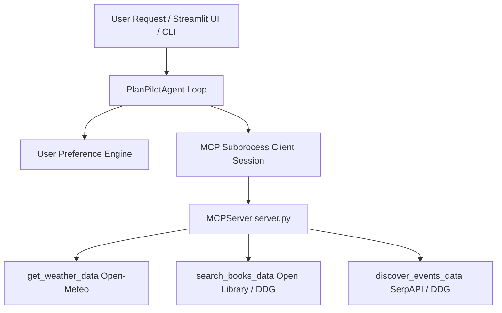

# 🧭 PlanPilot API Documentation

Welcome to the **PlanPilot API Documentation**. This reference guide covers the Model Context Protocol (MCP) tool API, Core Python Agent API, User Preference API, underlying Service API, and CLI interfaces with complete request/response examples.

---

## 🛠️ Table of Contents
1. [Architecture Overview](#-architecture-overview)
2. [MCP Tool Server API](#-mcp-tool-server-api)
   - [`get_weather`](#1-get_weather)
   - [`search_books`](#2-search_books)
   - [`discover_events`](#3-discover_events)
3. [PlanPilot Agent Python API](#-planpilot-agent-python-api)
   - [`PlanPilotAgent`](#planpilotagent-class)
   - [`run_query()`](#run_query)
   - [`reset()`](#reset)
4. [User Preferences API](#-user-preferences-api)
5. [Direct Services API](#-direct-services-api)
6. [CLI & Web Interface API](#-cli--web-interface-api)

---

## 🏗️ Architecture Overview



---

## 🔌 MCP Tool Server API

The PlanPilot MCP Tool Server (`planpilot.mcp_server`) communicates over stdio using standard Model Context Protocol (MCP) JSON-RPC specs.

### 1. `get_weather`

Fetch current weather and 12-hour precipitation forecast for a specified city.

#### **Parameters:**
| Parameter | Type | Required | Description | Example |
| :--- | :--- | :--- | :--- | :--- |
| `city` | `str` | Yes | Name of the target city (2-100 characters) | `"Ahmedabad"` |

#### **Python Execution Example:**
```python
from planpilot.tools.services import get_weather_data

weather_data = await get_weather_data("Ahmedabad")
print(weather_data)
```

#### **Sample JSON Response:**
```json
{
  "city": "Ahmedabad",
  "country": "India",
  "latitude": 23.02579,
  "longitude": 72.58727,
  "temperature_c": 28.5,
  "windspeed_kmh": 14.2,
  "weather_code": 1,
  "forecast_next_12h": {
    "any_rain_expected": false,
    "max_rain_probability_percent": 10,
    "total_expected_rain_mm": 0.0
  },
  "daily_forecast_3_days": [
    {
      "day": "Tuesday",
      "date": "2026-08-11",
      "temp_max_c": 31.2,
      "temp_min_c": 24.1,
      "weather_code": 1,
      "max_rain_probability_percent": 15
    }
  ]
}
```

---

### 2. `search_books`

Search for book recommendations, authors, and metadata.

#### **Parameters:**
| Parameter | Type | Required | Description | Example |
| :--- | :--- | :--- | :--- | :--- |
| `query` | `str` | Yes | Topic, author, or book title | `"science fiction"` |

#### **Python Execution Example:**
```python
from planpilot.tools.services import search_books_data

books = await search_books_data("science fiction")
print(books)
```

#### **Sample JSON Response:**
```json
[
  {
    "title": "Dune",
    "author": "Frank Herbert",
    "first_publish_year": 1965,
    "number_of_pages_median": 412,
    "info_url": "https://openlibrary.org/works/OL89341W"
  },
  {
    "title": "Foundation",
    "author": "Isaac Asimov",
    "first_publish_year": 1951,
    "number_of_pages_median": 255,
    "info_url": "https://openlibrary.org/works/OL47281W"
  }
]
```

---

### 3. `discover_events`

Discover live events, exhibitions, concerts, or activities happening in a city.

#### **Parameters:**
| Parameter | Type | Required | Description | Example |
| :--- | :--- | :--- | :--- | :--- |
| `city` | `str` | Yes | City name | `"Indore"` |
| `query` | `str` | No | Event category filter | `"music concerts"` |

#### **Python Execution Example:**
```python
from planpilot.tools.services import discover_events_data

events = await discover_events_data(city="Indore", query="music concerts")
print(events)
```

#### **Sample JSON Response:**
```json
[
  {
    "source": "Indore Music Fest 2026",
    "summary": "Live Open Air Venue | Saturday 7 PM | Featuring local indie bands. Info/Tickets: https://in.bookmyshow.com/events/indore-music-fest"
  },
  {
    "source": "Classical Sitar Night",
    "summary": "Auditorium Hall | Sunday 6 PM | Classical evening recital. Info/Tickets: https://allevents.in/indore/sitar"
  }
]
```

---

## 🤖 PlanPilot Agent Python API

The core orchestrator module `planpilot.agent.agent.PlanPilotAgent` manages conversation history, MCP tool calling loops, and quality assurance reflection.

```python
from planpilot.agent.agent import PlanPilotAgent

# Initialize the agent
agent = PlanPilotAgent()

# Run a query with an optional status callback and weekend goal
async def main():
    async def log_status(msg: str):
        print(f"[STATUS]: {msg}")

    response = await agent.run_query(
        user_query="weather in Indore today?",
        status_callback=log_status,
        goal="Relax"
    )
    print("\n[RESPONSE]:\n", response)

# Reset session history
agent.reset()
```

### Method Reference:
- `run_query(user_query: str, status_callback: Callable[[str], Awaitable[None]] | None = None, goal: str | None = None) -> str`
- `reset() -> None`

---

## 👤 User Preferences API

Module: `planpilot.utils.preferences`

Stores user profile memory (interests, dislikes, home city, budget) in JSON format (`~/.planpilot/user_preferences.json`).

```python
from planpilot.utils.preferences import (
    load_preferences,
    save_preferences,
    set_preference,
    build_preference_context,
)

# Set home city and budget
set_preference("home_city", "Indore")
set_preference("preferred_budget", "mid-range")

# Save complete profile
save_preferences({
    "home_city": "Indore",
    "interests": ["music concerts", "sci-fi books", "hiking"],
    "dislikes": ["horror movies"],
    "preferred_budget": "mid-range",
    "weekend_goal": "Explore",
    "indoor_preference": False,
    "custom_notes": "Vegetarian",
})

# Generate natural-language prompt context
prompt_context = build_preference_context()
print(prompt_context)
# Output: User Profile: Home city: Indore. Weekend goal: Explore. Interests: music concerts, sci-fi books, hiking. Dislikes: horror movies. Budget preference: mid-range. Notes: Vegetarian.
```

---

## ⚡ Direct Services API

Module: `planpilot.tools.services`

Direct service helper functions incorporating input validation (`validate_city_name`) and bounded HTTP timeouts.

```python
from planpilot.tools.services import (
    validate_city_name,
    get_weather_data,
    search_books_data,
    discover_events_data,
)

# City validation
clean_name = validate_city_name("  Ahmedabad! ") # -> "Ahmedabad"

# Direct async API calls
weather = await get_weather_data("Ahmedabad")
books = await search_books_data("python programming")
events = await discover_events_data("Mumbai", query="art exhibitions")
```

---

## 💻 CLI & Web Interface API

### CLI Command Execution
```bash
# Ask a single question via terminal
planpilot query "weather in Ahmedabad today?"

# Override default Ollama model
planpilot query "upcoming events in Indore" --model llama3.2:3b

# Start Streamlit Web Portal
planpilot ui
```
